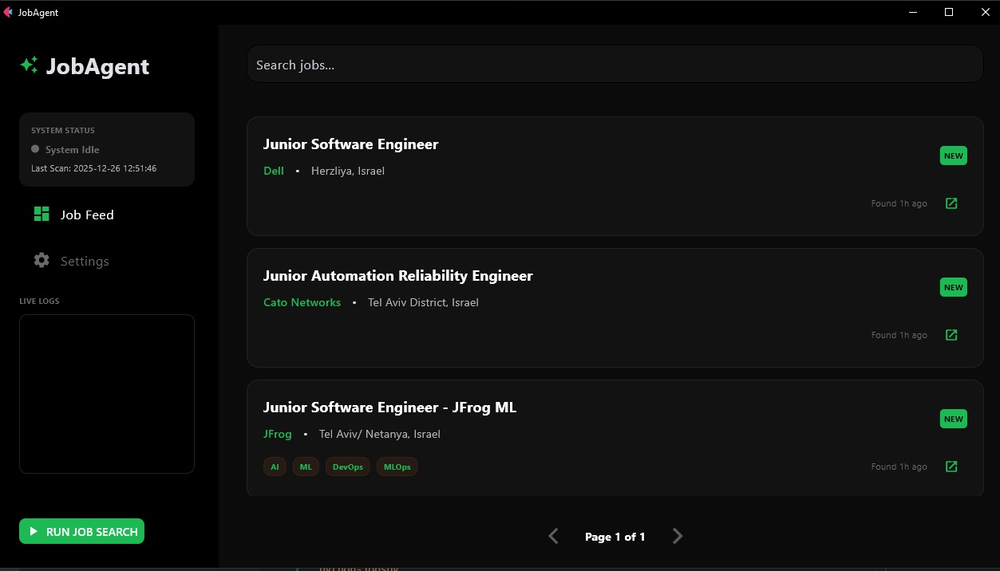
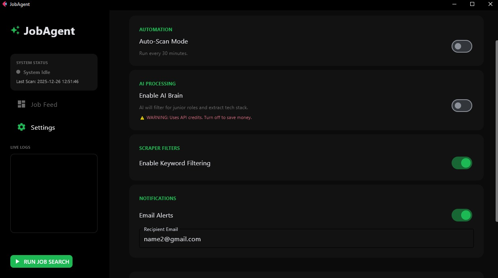
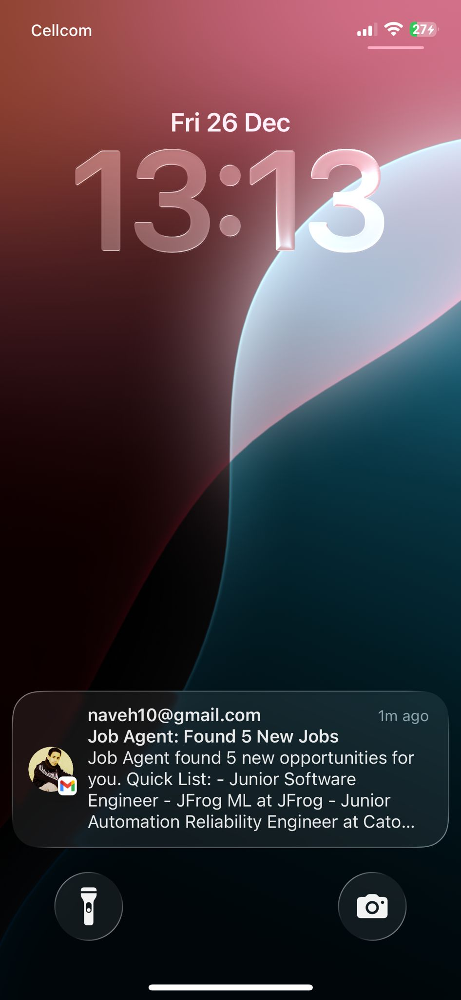
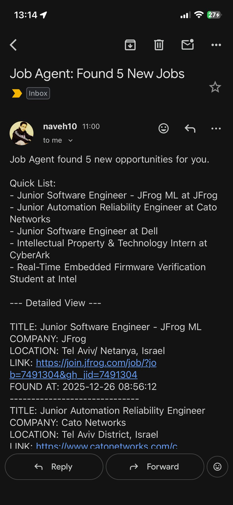

# JobAgent AI: Automated Junior Role Identification

JobAgent AI is a specialized automation pipeline designed to identify entry-level software positions within the Israeli technology sector. The system addresses the difficulty of manual job searching by implementing a multi-stage workflow: Scrape, Filter, AI Analysis, and Notification. Unlike standard aggregators, JobAgent AI utilizes GPT-4o-mini to analyze the full text of job descriptions. This ensures that roles labeled as "Software Engineer" which secretly require 5+ years of experience are discarded, while legitimate entry-level opportunities are prioritized.

## Screenshots
GUI with jobs found:


GUI with different settings:


Email and notifications:<br/>

<table>
  <tr>
    <td></td>
    <td></td>
  </tr>
</table>

### Core Capabilities and Coverage
The agent adapts its fetching strategy across four major Applicant Tracking Systems (ATS) and broad job board aggregators to provide a realistic market view.
* **Direct ATS Integration:** Native support for Workday (Intel, Nvidia, Dell), Greenhouse (Wiz, Melio), Comeet (Fiverr, Team8), and SmartRecruiters (CyberArk).
* **Job Board Aggregation:** Utilizes JobSpy to scan LinkedIn and Glassdoor for new listings added in the last 24 hours, detecting "hidden" junior roles.
* **AI-Powered Vetting:** GPT-4o-mini searches for experience indicators such as "0-2 years," "new grad," or "intern" within the full job description.
* **Strict Localization:** High-precision filtering for Israel-based roles only (Tel Aviv, Haifa, Yokneam, etc.).
* **Performance Architecture:** Employs lazy loading to fetch full descriptions only for relevant roles, reducing bandwidth and API costs.
* **Management Dashboard:** A dark-themed GUI built with Flet for real-time monitoring, live logging, and job feed management.

## Technical Reference

### Stack and Project Map
* **Backend:** Python 3.10+ using `requests`, `beautifulsoup4`, `pydantic`, and `python-jobspy`.
* **Interface:** Flet (Flutter for Python).
* **AI Logic:** OpenAI API (GPT-4o-mini).
* **Database:** SQLite (Local).

**File Map:**
* `src/gui.py`: Dashboard interface and auto-scan logic.
* `src/engine.py`: Conductor for Scrape, AI, and Email pipeline.
* `src/brain.py`: Structured AI analysis logic.
* `src/storage.py`: SQLite database management.
* `run_pipeline.py`: Independent scraper worker process.
* `authorization.txt` & `filters.txt`: Credentials and keyword exclusion lists.

### Database State Logic
The system manages job states in the `is_relevant` column using the following integer values to ensure smart deduplication:
* **0 (Unprocessed):** Job has been scraped but not yet analyzed by the AI.
* **1 (Relevant):** AI has confirmed the role is suitable for 0-2 years of experience.
* **-1 (Irrelevant):** AI has rejected the role due to experience requirements or title mismatch.

## Installation and Configuration

1. Clone the repository:
   git clone https://github.com/your-username/job-agent-ai.git

2. Install required dependencies:
   pip install flet openai pydantic requests beautifulsoup4 python-jobspy

3. Configure credentials: Create an authorization.txt file in the root directory and add the following lines, replacing the placeholders with your actual keys:

```
# --- EMAIL CONFIGURATION ---
EMAIL_USER=name1@gmail.com
EMAIL_PASS=XXXX XXXX XXXX XXXX
RECIPIENT_EMAIL=name2@gmail.com

# --- AI & API SETTINGS ---
# Replace ENTER HERE with your actual sk- key
OPENAI_API_KEY=ENTER HERE

# --- APPLICATION TOGGLES ---
AUTO_SCAN_ENABLED=False
AI_ENABLED=False
FILTER_ENABLED=True

# --- SYSTEM DATA ---
LAST_SCAN_TIME=Never
```

## Execution
To launch the application dashboard, run the following command from the root directory:
```
python -m src.gui
```

## Configuration of Targets

Edit:
```
config/targets.json
```

### Example: Greenhouse company
```json
{
  "name": "Wiz",
  "board_token": "wizinc",
  "type": "greenhouse"
}
```

### Example: Job board aggregation
```json
{
  "name": "Aggregator: Broad Search",
  "type": "jobspy",
  "sites": ["linkedin", "glassdoor"],
  "search_term": "Software Engineer",
  "location": "Israel",
  "limit": 30
}
```

## License

This project is open-source.  
Feel free to fork, extend, and help the junior developer community.
